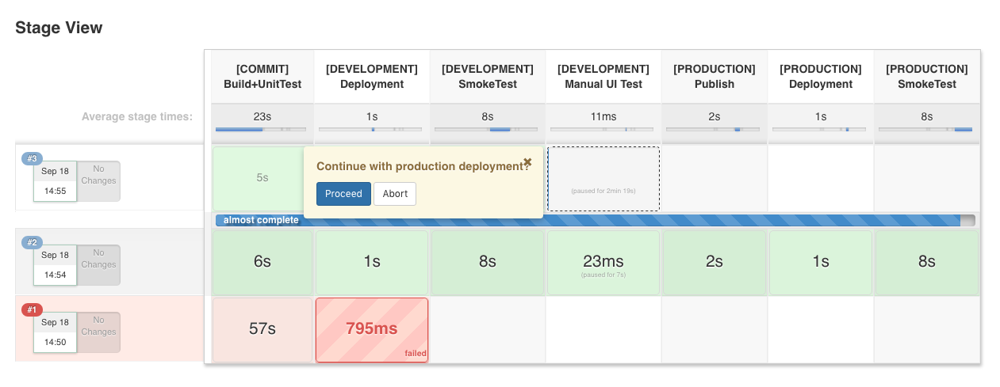

# Jenkins 2.0 Pipelines
## Subheading with even more buzzwords

2-3 sentence abstract
* Local CD environment vagrant, ansible
* Pre-configured Jenkins Pipeline
* Starting point to play with pipelines in production-like scenario

### Intro / Local environment
* Short explanation of local sandbox infrastructure
* Maybe a small/simple diagram showing VMs + Networking + App
* Links to repos

### Continuous Delivery scenario concept
* Short explanation of the CD scenario we build
* Maybe visualisation of stages + steps

### Jenkins Pipelines and Jenkinsfiles
<a name=„jenkinsPipelines“/> 
In the last blogpost about Jenkins 2.0 **[LINK]**, which focused on the configuration and administration of Jenkins 2.0, we gave a quick overview of the new Pipline plugin and its features. Now we want to have a closer look at the capabilities of the Pipeline plugin and work out the major innovations and differences that are introduced by the plugin. 

#### Freestyle Jobs vs. Pipelines
<a name=„freestyleVsPipelines“/> 

The conventional way of building applications with Jenkins is to define a series of sequential executable steps, each configured as a freestyle job, and then trigger one
after the other until the whole build process is completed. The chaining of freestyle jobs is usually done via the Jenkins UI, which makes changes and reconfigurations of 
the job chain rather inconvenient. But fear not, the Jenkins Pipline plugin is here for the rescue! With the new plugin it becomes possible to orchestrate all workflow steps from commit to deployment within a single job. This job is defined using the Pipeline DSL (domain specific language), which is based on Groovy. Let's have a quick look at the vocabulary of the Pipeline DSL: in the following we have a listing of the three most important terms when it comes to writing pipeline scripts.

* **Stage**: stages are used to break your pipeline into logically distinct sections, which can include one or more build steps. All steps defined within a stage are then visualized as a unique segment in the Pipeline UI.
* **Step**: build steps are the single executable tasks, which can be chained together in sequence to form stages.
* **Node**: nodes are wrappers for resource-intensive steps, which should be scheduled and executed in a separate workspace, in order to avoid negative impacts on the overall pipeline performance.

So using a single job definition for creating build chains already makes life more convenient, but there is still more to it than that. The Pipeline plugin also offers new features that could not be realized so easily prior to Jenkins 2.0:

* Interruptions of the pipeline process (e.g. by restart of the Jenkins master) can be handled gracefully now with a persistent record of execution.
* Manual quality gates can be introduced into the workflow, where the pipeline process halts and waits for manual input.
* More complex workflows can be designed which include forks, joins, loops and parallel executions.

The following picture is a screenshot of the Jenkins Pipeline UI of our projects, showing the pipeline currently waiting for manual input at the quality gate.




#### Pipeline as Code
<a name=„pipelineAsCode“/> 

Another big advantage of the Pipeline plugin is the 'Pipeline as code' feature. Instead of defining a Pipeline job via the Jenkins UI, it is now possible to store the configuration in an external file (called Jenkinsfile), which can easily be put under version control. Jenkins can then be configured to automatically scan repositories for Jenkinsfiles and setup a new build pipeline accordingly. Having the project code as well as the build/deployment configuration under the same roof seems to be the new trend at the moment, but after some discussion on this topic, we still remain skeptical towards this approach (see [conclusion](#conclusion)). Despite our skepticism, the 'Pipeline as code' feature also offers some clear advantages that should not be neglected here:

* **Versioning of job definitions**: Putting the configuration under version control creates traceability and persistency
* **Sharing and Reuse**: job definitions can be easily shared and reused for similar builds
* **Automation**: New build pipeline are automatically created for new branches.
* **Adaptation**: the build pipeline can easily be manipulated without touching the Jenkins UI

As an example for a full-blown Jenkinsfile, the following code snipped shows the JAR deployment Jenkinsfile  of our project:

```groovy
#!groovy

stage("[COMMIT] Build+UnitTest")
node {
  git branch: 'master', poll: true, url: 'https://github.com/Endron/dnd5-char-viewer.git'
  sh "./gradlew clean build"
  junit '**/build/test-results/*/*.xml'
}

stage("[DEVELOPMENT] Deployment")
node {
  sshagent(credentials: ['jenkins-ci']) {
    sh 'ssh -o StrictHostKeyChecking=no -l ubuntu 192.168.42.11 mkdir -p dnd5-char-viewer'
    sh 'scp -o StrictHostKeyChecking=no build/libs/*.jar ubuntu@192.168.42.11:dnd5-char-viewer/'
    sh 'ssh -o StrictHostKeyChecking=no -l ubuntu 192.168.42.11 "cd ./dnd5-char-viewer; killall -9 java; java -jar *.jar 2>> /dev/null >> /dev/null &"'
  }
}

stage("[DEVELOPMENT] SmokeTest")
node {
  timeout(time: 60, unit: 'SECONDS') {
    sh 'until $(curl --silent --head --fail http://192.168.42.11:8080 > /dev/null); do printf \'.\'; sleep 1; done; curl http://192.168.42.11:8080 | grep \'ng-app="characterViewer"\''
  }
}

stage("[DEVELOPMENT] Manual UI Test")
input "Continue with production deployment?"

stage("[PRODUCTION] Publish")
node {
  def server = Artifactory.newServer('http://localhost:8081/artifactory', 'admin', 'password')
  def uploadSpec = """{
    "files": [
      {
        "pattern": "build/libs/dnd5-char-viewer.jar",
        "target": "ext-release-local/dnd5-char-viewer/dnd5-char-viewer.jar"
      }
    ]
  }"""
  server.upload(uploadSpec)
}

stage("[PRODUCTION] Deployment")
node {
  sshagent(credentials: ['jenkins-ci']) {
    sh 'ssh -o StrictHostKeyChecking=no -l ubuntu 192.168.42.12 mkdir -p dnd5-char-viewer'
    sh 'scp -o StrictHostKeyChecking=no build/libs/*.jar ubuntu@192.168.42.12:dnd5-char-viewer/'
    sh 'ssh -o StrictHostKeyChecking=no -l ubuntu 192.168.42.12 "cd ./dnd5-char-viewer; killall -9 java; java -jar *.jar 2>> /dev/null >> /dev/null &"'
  }
}

stage("[PRODUCTION] SmokeTest")
node {
  timeout(time: 60, unit: 'SECONDS') {
    sh 'until $(curl --silent --head --fail http://192.168.42.12:8080 > /dev/null); do printf \'.\'; sleep 1; done; curl http://192.168.42.12:8080 | grep \'ng-app="characterViewer"\''
  }
}
```

#### Multi-branch pipelines
<a name="multibranch"/>
Another interesting feature are multi-branch pipelines. A multi-branch project //must// have a ``Jenkinsfile`` in its
root directory. Whenever a new branch is created, Jenkins automatically detects this and creates a pipeline for it.
While this is quite convenient, we did not look into this feature further exactly because of the afore-mentioned
requirement to put the ``Jenkinsfile`` into the actual project sources, which we personally consider bad style (see
[conclusion](#conclusion)).


#### Deploying Jars

<!--
We need to reformulate the starting sentence.
-->

As an alternative to the dockerized deployment, it's of course possible to deploy the whole application the
old-fashined way, running directly on the target node. In our case, this is made easy by the fact that the sample
application is a Spring Boot application that packages its whole runtime environment (except for the JRE, of course,
but including its own web server).

```groovy
stage("[DEVELOPMENT] Deployment") {

    sshagent(credentials: ['jenkins-ci']) {
      sh 'ssh -o StrictHostKeyChecking=no -l ubuntu 192.168.42.11 -p mkdir -p dnd5-char-viewer
      sh 'scp -o StrictHostKeyChecking=no build/libs/*.jar ubuntu@192.168.42.11:dnd5-char-viewer/'
      sh 'ssh -o StrictHostKeyChecking=no -l ubuntu 192.168.42.11 "cd ./dnd5-char-viewer; killall -9 java; java -jar *.jar 2>> /dev/null >> /dev/null &"'
    }
  }
```

The deployment is done via secure shell commands. Again, we wrap the communication with the SSH-Agent plugin to provide
credentials stored in Jenkins' repository to our secure session, that runs the following commands:
1. Create the directory ``dnd5-char-viewer``
1. Copy the JAR file containing the application
1. Change to the new directory, kill all Java processes on the target system (this is **not** recommended to do in a
production environment), and finally run the application.  

#### Publishing artifacts
A lot of projects, especially open source libraries and frameworks, need to be published to a public repository after
a new version was built and tested successfully. To simulate this, the build environment provides an
[Artifactory OSS](https://www.jfrog.com/open-source/) installation to which Jenkins will upload the JAR file.
```groovy
stage("[PRODUCTION] Publish") {
  def server = Artifactory.newServer('http://localhost:8081/artifactory', 'admin', 'password')
  def uploadSpec = """{
    "files": [
      {
        "pattern": "build/libs/dnd5-char-viewer.jar",
        "target": "ext-release-local/dnd5-char-viewer/dnd5-char-viewer.jar"
      }
    ]
  }"""
  server.upload(uploadSpec)
}
```
Our Jenkins environment already has the required Artifactory plugin installed (please note that this doesn't come with
Jenkins per default and normally needs to be installed manaully). While the recommended way to instantiate the 'server'
instance is to make it reference an Artifactory instance pre-configured in the Jenkins configuration, the example
Jenkinsfile avoids this in favor of configuring the server directly. Of course, this is also a bad idea for a
production build because it put the user name and password into the Jenkinsfile.
The upload commands receives a specification written in JSON. Since it could become quite complex for larger projects,
it is possible to put in into an external file and reference it. For our purposes, it is enough to provide the
specification inline.
After the project has been built successfully and passed the stage **[PRODUCTION] Publish**, head over to
``http://localhost:28080/artifactory``. The repository should look like this:


#### Deploying Docker containers
In the now let's take a look at our second deployment pipeline. This one deployes
our application as a Docker container. (Admittedly just because we can.) The more
interesting part of this second pipeline is that we now show of some of the things
we get by our pipeline definition beeing Groovy code.

```groovy
def switchContainer = { String serverName, List<String> credentials, String containerName, String dockerImageToUse, String appPort, String serverPort ->
  sshagent(credentials: credentials) {
    sh "ssh -o StrictHostKeyChecking=no -l ubuntu ${serverName} docker pull ${dockerImageToUse}"

    sh "ssh -o StrictHostKeyChecking=no -l ubuntu ${serverName} docker stop ${containerName} || true"
    sh "ssh -o StrictHostKeyChecking=no -l ubuntu ${serverName} docker rm ${containerName} || true"
    sh "ssh -o StrictHostKeyChecking=no -l ubuntu ${serverName} docker run -d --name ${containerName} -p ${serverPort}:${appPort} ${dockerImageToUse}"
  }
}
```

The first thing is ``def switchContainer``. This is a Groovy variable declaration. As should
be obvious to most being able to define variables and reference them in your script is a
good way to make your script more maintainable as it reduces the parts that change. For example
if we define variables for the IP addresses of our target server instead of repeating them
again and again in the script we will have a lot easier time if we ever need to change them.

The next part (what we assigne the variable) is a Groovy Closure. This is Groovy's
way of doing functional programming. If you are more familiar with Java this is kind
of like the new Lambdas that where added in Java 8. What this allows us to do is
reuse our code in multiple places. The code to start our Docker container is on a
fundamental level the same for the DEVELOPMENT environment and the PRODUCTION environment.
So we want to refactor out a function to do this instead of repeating the code in
multiple places.

Also our Closure uses a list of variables. Everything before ``->`` is a varaible defined
to be used in the Closure. These are then used in the body of the Closure. The body itself
is a very basic script to pull a given Docker image to the server and replace a container
with the given name with a new one using the new image.

While this is already nice it is not yet showing of the real power of a higher programming
language. For this we must move to where we invoke the Closure.

```groovy
stage("[DEVELOPMENT] Deployment")
node {
  def credentials = ['jenkins-ci']
  def appPort = '8080'

  def containers = [
      [name: 'dndViewer01', serverPort: '9081'],
      [name: 'dndViewer02', serverPort: '9082'],
      [name: 'dndViewer03', serverPort: '9083']
  ]
  for (def container : containers) {
    switchContainer(devServerName, credentials, container.name, dockerImage, appPort, container.serverPort)
  }
}
```

In our DEVELOPMENT environment we want to start three Docker container with the
application (named ``dndViewer01``, ``dndViewer02`` and ``dndviewer03``). And because we
are using Groovy as the language for our Script we can do this in a loop. In our case
we create a Map for each of our three container containing what is specific for it. That
is its name and the port on the server it should be bound to. We then put these maps
in a List. As we use Groovy's Map and List syntax this all happens in only a few lines
of code. We then iterate over this list to bring up the container.

### Conclusion / Summary
<a name="conclusion"/>
* Bla bla what we learned

#### Job configuration as code

The idea of having the configuration as code under version control is the one of
the main selling points of the new pipeline plugin. And we think that this is
something we will see more of in the future. This can help solve two old problems
with CI pipelines:
* How to share job definitions for similar builds
* How to version job definitions
We think that having the job definition in a git repository and using the established
tools and workflows to make changes to them addresses these problems. As this is still
in its infancy we cannot yet tell if this is the sollution and what new problems this
might produce. But we think it to be a step in the right direction.

#### Location of the ``Jenkinsfile``

It is a matter of personal style and preferences to decide whether the pipeline code (the ``Jenkinsfile``) should
reside in the same repository as the actual project sources. The Jenkins developers and the community seem to advertise
this style, which becomes quite visible when one tries to use the '[Multi-branch pipeline](#multibranch)' feature.
After a lot of discussion, however, we agreed that we do not consider this a very good style, because:
* It ties the project code together with Jenkins
* When building 3rd-party code, it is required to fork it and add a Jenkinsfile
* It puts information about the intended target environment into a build that should be agnostic to such information

A possible way around this could be to use git's submodule feature. This would
allow us to have a git repository with the ``Jenkins`` file and have the repository
with the actual code added as a submodule. With this we would lose the advantage
of Jenkins finding new branches and automatically creating a build pipeline for
them but we could continue to keep our source code clean from Jenkins' configuration.
As in most scenarios the number of parallel deployment environments is limited
having multiple deployment pipelines might be not possible to beginn with.

#### Missing things

Even after working with pipelines for only a limited time it became clear that the whole
DSL is still missing things you would expect to find. One such example is that most of
the methods from the DSL have no return value you could use to find out information on
your build. For example in our Docker pipeline we wanted to get the git commit ID to
name our Docker container based on this. (Basically as an easy way to version our container
and synchronize them with git.) To do we had to jump a few hoops:

```groovy
def gitCommitId
stage("[COMMIT] checkout")
node {
  git branch: 'master', poll: true, url: 'https://github.com/Endron/dnd5-char-viewer.git'
  sh 'git rev-parse HEAD > git.id'
  gitCommitId = readFile('git.id')
}
```

Because the ``git`` method has no return type we have to use git from the shell
to get the commit ID. But because the ``sh`` method also has no return value we
have to write the commit ID to a file we then read using the ``readFile`` method.

From this is clear that there is still room for improvement of the DSL. 

### Acknowlegements
* names of the guys we took the Ansible roles from. (Just to be fair and avoid trouble)


##### Some references:
* https://dzone.com/articles/jenkins-pipeline-plugin-tutorial
* https://jenkins.io/solutions/pipeline/
* https://dzone.com/refcardz/continuous-delivery-with-jenkins-workflow
* ...
