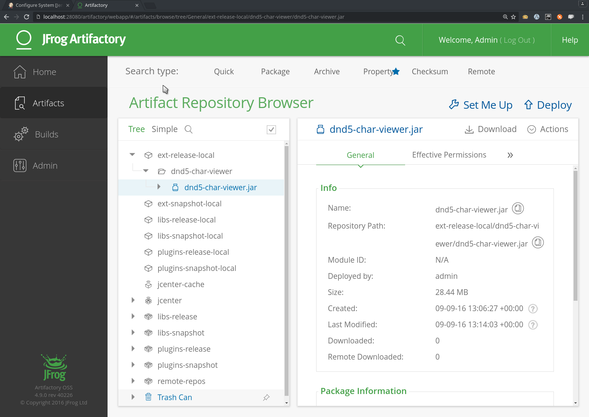

# Jenkins 2.0 Pipelines
## Subheading with even more buzzwords

2-3 sentence abstract
* Local CD environment vagrant, ansible
* Pre-configured Jenkins Pipeline
* Starting point to play with pipelines in production-like scenario

### Intro / Local environment
* Short explanation of local sandbox infrastructure
* Maybe a small/simple diagram showing VMs + Networking + App
* Links to repos

### Continuous Delivery scenario concept
* Short explanation of the CD scenario we build
* Maybe visualisation of stages + steps

### Jenkins pipeline + Jenkins file explained
* Some words on Jenkins Pipeline / Pipeline as Code

    * Why Pipeline is useful: Jenkins Jobs vs. Pipelines
        * Freestyle Jobs can only define sequential executable steps but not the whole application lifecycle of an application.
        * Pipelines offers the possibility to orchestrate all workflow steps from commit to delpoyment in a single job, which
       offers plenty of new possibilities:
            1. interruptions of the pipeline (by restart of the jenkins master for example) can be handled gracefully.
            2. Manual quality gates can be introduced to the workflow, where the pipelines halts and waits for manual input.
            3. complex workflows which include forks, joins, loops and parallel executions

* Gist of Jenkinsfile

    * Another big advantage of the pipeline plugin is that in enables the "Pipeline as Code" feature. Instead of defining the
  single workflow steps through the Jenkins UI, the whole configuration process can be done in single file (called Jenkinsfile)
  using a Pipeline DSL (domain specific language), which is based on Groovy. The Jenkinsfile can then simply be checked
  into the repository. Two main advantages of the this "Pipeline as Code" approach are:
         1. revisioning of the pipline
         2. build chain can easily be manipulated without touching the Jekins UI

* Transition text to Pipeline using Docker + Pipeline using jar/spring-boot

#### Multi-branch pipelines
<a name="multibranch"/>
Another interesting feature are multi-branch pipelines. A multi-branch project //must// have a ``Jenkinsfile`` in its
root directory. Whenever a new branch is created, Jenkins automatically detects this and creates a pipeline for it.
While this is quite convenient, we did not look into this feature further exactly because of the afore-mentioned
requirement to put the ``Jenkinsfile`` into the actual project sources, which we personally consider bad style (see
[conclusion](#conclusion)).


#### Deploying Jars

<!--
We need to reformulate the starting sentence.
-->

As an alternative to the dockerized deployment, it's of course possible to deploy the whole application the
old-fashined way, running directly on the target node. In our case, this is made easy by the fact that the sample
application is a Spring Boot application that packages its whole runtime environment (except for the JRE, of course,
but including its own web server).

```groovy
stage("[DEVELOPMENT] Deployment") {

    sshagent(credentials: ['jenkins-ci']) {
      sh 'ssh -o StrictHostKeyChecking=no -l ubuntu 192.168.42.11 -p mkdir -p dnd5-char-viewer
      sh 'scp -o StrictHostKeyChecking=no build/libs/*.jar ubuntu@192.168.42.11:dnd5-char-viewer/'
      sh 'ssh -o StrictHostKeyChecking=no -l ubuntu 192.168.42.11 "cd ./dnd5-char-viewer; killall -9 java; java -jar *.jar 2>> /dev/null >> /dev/null &"'
    }
  }
```

The deployment is done via secure shell commands. Again, we wrap the communication with the SSH-Agent plugin to provide
credentials stored in Jenkins' repository to our secure session, that runs the following commands:
1. Create the directory ``dnd5-char-viewer``
1. Copy the JAR file containing the application
1. Change to the new directory, kill all Java processes on the target system (this is **not** recommended to do in a
production environment), and finally run the application.  

#### Publishing artifacts
A lot of projects, especially open source libraries and frameworks, need to be published to a public repository after
a new version was built and tested successfully. To simulate this, the build environment provides an
[Artifactory OSS](https://www.jfrog.com/open-source/) installation to which Jenkins will upload the JAR file.
```groovy
stage("[PRODUCTION] Publish") {
  def server = Artifactory.newServer('http://localhost:8081/artifactory', 'admin', 'password')
  def uploadSpec = """{
    "files": [
      {
        "pattern": "build/libs/dnd5-char-viewer.jar",
        "target": "ext-release-local/dnd5-char-viewer/dnd5-char-viewer.jar"
      }
    ]
  }"""
  server.upload(uploadSpec)
}
```
Our Jenkins environment already has the required Artifactory plugin installed (please note that this doesn't come with
Jenkins per default and normally needs to be installed manaully). While the recommended way to instantiate the 'server'
instance is to make it reference an Artifactory instance pre-configured in the Jenkins configuration, the example
Jenkinsfile avoids this in favor of configuring the server directly. Of course, this is also a bad idea for a
production build because it put the user name and password into the Jenkinsfile.
The upload commands receives a specification written in JSON. Since it could become quite complex for larger projects,
it is possible to put in into an external file and reference it. For our purposes, it is enough to provide the
specification inline.
After the project has been built successfully and passed the stage **[PRODUCTION] Publish**, head over to
``http://localhost:28080/artifactory``. The repository should look like this:



#### Deploying Docker containers
* Docker pipeline in detail

### Conclusion / Summary
<a name="conclusion"/>
* Bla bla what we learned

It is a matter of personal style and preferences to decide whether the pipeline code (the ``Jenkinsfile``) should
reside in the same repository as the actual project sources. The Jenkins developers and the community seem to advertise
this style, which becomes quite visible when one tries to use the '[Multi-branch pipeline](#multibranch)' feature.
After a lot of discussion, however, we agreed that we do not consider this a very good style, because:
* It ties the project code together with Jenkins
* When building 3rd-party code, it is required to fork it and add a Jenkinsfile
* It puts information about the intended target environment into a build that should be agnostic to such information

A possible way around this could be to use git's submodule feature. This would
allow us to have a git repository with the ``Jenkins`` file and have the repository
with the actual code added as a submodule. With this we would lose the advantage
of Jenkins finding new branches and automatically creating a build pipeline for
them but we could continue to keep our source code clean from Jenkins' configuration.
As in most scenarios the number of parallel deployment environments is limited
having multiple deployment pipelines might be not possible to beginn with.

### Acknowlegements
* names of the guys we took the Ansible roles from. (Just to be fair and avoid trouble)


##### Some references:
* https://dzone.com/articles/jenkins-pipeline-plugin-tutorial
* https://jenkins.io/solutions/pipeline/
* https://dzone.com/refcardz/continuous-delivery-with-jenkins-workflow
* ...
